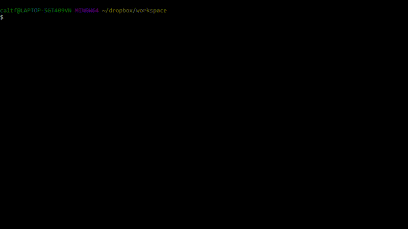

# rm-init

A CLI program that generates a simple README.md based on information given

Powered by Node.js

## Installation

After installing [Node.js](https://nodejs.org/), run the following command in your package directory:

```
npm install -g github:ducktrshessami/rm-init
```

## Usage

```
rminit [[-o | --output] filename]
```

`-o, --output`: Specifiy the output filename

Defaults output file to `README.md` and overwrites any existing output file

## Video Example

<details>

<summary>Show/Hide</summary>



Example output: [EXAMPLE.md](https://gist.github.com/ducktrshessami/2b31bd73e21b8dec1d64ae36f12c86a5)

</details>
